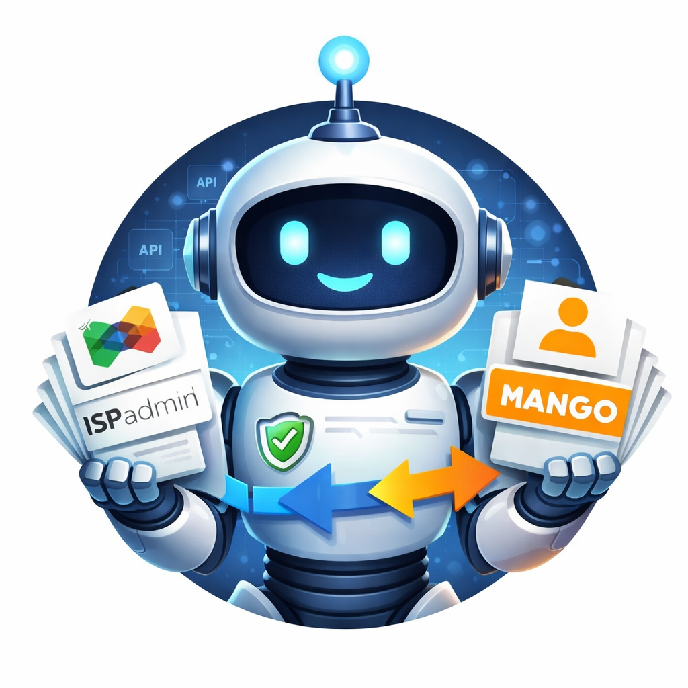

# Mango Migrator UI

<p align="center">
  
</p>

Webova aplikace pro synchronizaci klientu z ISPAdmin REST API do Mango SOAP API.

## Co aplikace dela

Po kliknuti na `Start` aplikace:

1. nacte deaktivovane klienty z ISPAdmin API pres `GET /clients?active=0`
2. nacte aktivni klienty z ISPAdmin API pres `GET /clients?active=1`
3. nacte aktivni uzivatele z Mango
4. lokalne porovna data
5. do Mango zapise jen zmeny:
   - deaktivuje klienty, kteri jsou v ISPAdminu odpojeni
   - vytvori klienty, kteri jsou v ISPAdminu aktivni a v Mango jeste nejsou
6. ulozi JSON report do `data/reports`

## Automaticky beh

Aplikace umi planovany autorun:

- `Enable automated sync` zapne scheduler
- `Start time` urci prvni cas spusteni
- `Interval (hours)` urci periodu dalsich behu
- scheduler a manualni `Start` pouzivaji stejny run guard, takze nikdy nepobezi dva joby soucasne
- pokud je v case autorunu jiz spusten manualni nebo jiny planovany beh, scheduler pocka a spusti dalsi beh az po uvolneni locku
- heartbeat watchdog hlida jen manualni behy z browseru; scheduler bezi server-side bez zavislosti na otevrene strance

Konfigurace scheduleru je ulozena v `data/schedule.json`.

## Konfigurace

Aplikace cte runtime konfiguraci z `cibs.env`.

### Mango SOAP

- `CIBS_ENV`
- `CIBS_BASE_URL_TEST`
- `CIBS_BASE_URL_PROD`
- `CIBS_VERIFY_TLS`
- `CIBS_CT`
- `CIBS_USERNAME`
- `CIBS_PASSWORD`

`CIBS_CT` je povinny a musi byt vyplneny v `cibs.env`.

### ISPAdmin REST API

- `ISPADMIN_API_BASE_URL`
  - napr. `https://your-ispadmin.example/api/v1`
- `ISPADMIN_API_TOKEN`
- `ISPADMIN_VERIFY_TLS`
- `ISPADMIN_API_TIMEOUT_SEC`

### Telegram notifications

- `TELEGRAM_BOT_TOKEN`
- `TELEGRAM_CHAT_ID`
- `TELEGRAM_MESSAGE_THREAD_ID`
  - volitelne, jen pokud posilas do konkretniho topicu ve forum group chatu
- `TELEGRAM_DISABLE_WEB_PREVIEW`
- `TELEGRAM_API_TIMEOUT_SEC`

### Volitelne runtime nastaveni

- `MANGO_KEEPALIVE_TIMEOUT_SEC`
- `MANGO_SCHEDULER_POLL_SEC`

Pokud jsou `TELEGRAM_BOT_TOKEN` a `TELEGRAM_CHAT_ID` vyplnene, aplikace po kazdem behu posle Telegram zpravu s:

- stavem behu (`done`, `error`, `cancelled`)
- typem behu (`manual`, `schedule`)
- zacatkem, koncem a delkou behu
- statistikou deaktivaci a importu
- pripadnou chybou

## Lokalni beh

```bash
docker compose up -d --build
```

UI pobezi na `http://localhost:8099`.

## Backend endpointy

- `GET /`
- `GET /sync-logo.svg`
- `POST /api/start`
- `POST /api/stop?confirm=STOP`
- `POST /api/keepalive`
- `POST /api/disconnect`
- `POST /api/schedule`
- `GET /api/status`
- `GET /api/events`
- `GET /api/reports`
- `GET /api/reports/{name}`
- `GET /api/reports/{name}/download`

## Poznamky

- bezi vzdy jen jeden job
- stop je safe-stop, ne hard kill
- import i deaktivace se paruji do Mango pres `clientNumber` z ISPAdminu
- pokud klient v ISPAdmin API nema `clientNumber`, zaznam se preskoci
- reporty jsou ukladany do `/app/data/reports`
